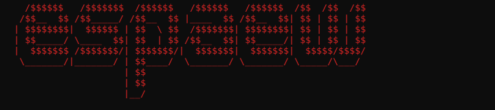

---

## About

Cybersecurity engineering student focused on systems security, low-level programming, and offensive security.

I compete in CTF competitions, build security tooling, and explore topics that go beyond the classroom — from cryptography and formal methods to OSINT and network analysis.

---

## Highlights

| Event | Result | Team |
|---|---|---|
| HackTheBox — University CTF 2025 | 🥉 3rd place worldwide | GCC-ENSIBS |

---

## Technical Stack

### 🚀 Programming Languages

### 🛡️ Security Tools

### 🐧 Systems & OSINT

---

## Organizations

|  |  |  |
|:---:|:---:|:---:|
| [**espaew-academic**](https://github.com/espaew-academic) | [**espaew-ctf**](https://github.com/espaew-ctf) | [**espaew-projects**](https://github.com/espaew-projects) |
| academic curriculum | CTF · exploitation | personal projects |

---

